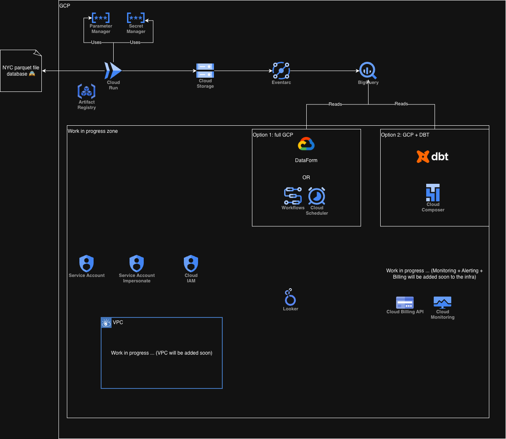
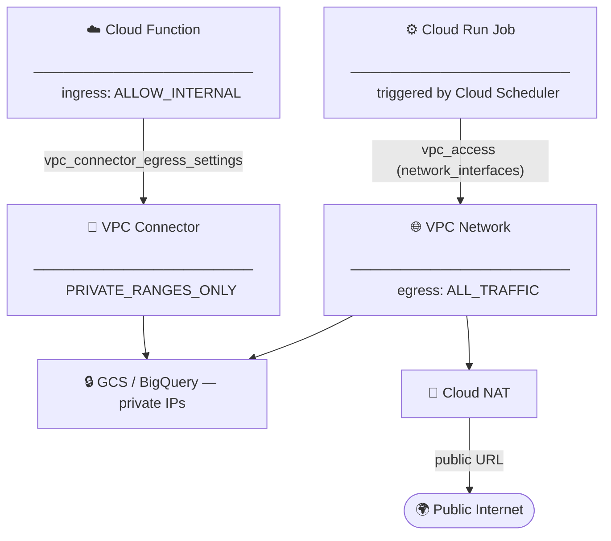

# NYC taxi pipeline from raw data to vizualisation & IA


## What is NYC Taxi database ?
[NYC Taxi & Limousine Comissions](https://www.nyc.gov/site/tlc/about/tlc-trip-record-data.page) is a very popular database for data engineering and data science projects, it contains a lot of interesting data on taxi trips in NYC and it's a great playground to demonstrate data engineering skills on GCP.

## Overview
This is a complete end to end data pipeline on GCP with terraform as IaC (Terraform), Cloud Functions, Cloud Run, BigQuery, Looker and more.
It will demonstrate my skills Data Enginering skills on GCP, Terraform and DBT.

## Disclaimers

> [!NOTE]
> - ℹ️ This project is in work in progress 🏗️
> - ✍️ Handwritten code — I can explain every technical decision in this codebase.

## Architecture


### VPC explanation
- For the cloud run job: uses Direct VPC (network_interfaces) with egress ALL_TRAFFIC — Cloud NAT required to reach the public internet (download NYC data)
- For the cloud function: only allow internal GCP network so ingress ALLOW_INTERNAL (triggered by Eventarc only) — vpc_connector egress PRIVATE_RANGES_ONLY (BigQuery access, no public internet needed)




## Key Design Decisions

| Decision | Why |
| --- | --- |
| Direct VPC on CR Job, VPC Connector on CF | Direct VPC is Google's recommended approach since 2023 (lower latency, no extra billable resource). VPC Connector is the only option available for `google_cloudfunctions2_function` in Terraform. |
| Eventarc over Pub/Sub polling | Native push trigger on `object.finalized` — no consumer to maintain, built-in retries, zero cost when idle. |
| BigQuery partition by day + cluster by location | Partition pruning on time-range queries reduces bytes scanned. Clustering cuts scan size further for location-based filters — the two most common patterns on this dataset. |
| 4 parallel CR Job tasks | One task per source file, each independently idempotent via `CLOUD_RUN_TASK_INDEX`. Static for now, extensible. |
| 3 distinct service accounts | Limits blast radius: ingest SA can't touch BigQuery, load SA can't trigger jobs. |

## DBT Project
https://github.com/messaoudia/dbt_nyc_taxi_bigquery

## Terraform
### Init required tf state bucket
To be able to use this project you need to first create the tf stated bucket where will be stored tf state per env

cd terraform/required
terraform init
terraform plan (done in apply also but to be safe)
terraform apply

### Per env apply
cd terraform/...
terraform init -backend-config=backend.hcl

# Service Account Impersonate
Service accounts are very important for several reasons. One of them is testing your flow locally using least privilege conditions by impersonating the service account via gcloud cli, you can test in real conditions with the exact same permissions as production, avoiding any surprises at deployment time.

> [!TIP]
> You can use the provided auth.sh script to easily switch between service account

<details>
<summary>auth.sh</summary>
<br>

```sh
# scripts/auth.sh

#!/bin/bash

ACTION=$1  # "deploy" ou "local"
SA=$2      # Service Account email (ex: "nyctaxi-load-bq-sa-dev@nyc-taxi-gcp-pipeline.iam.gserviceaccount.com")

case $ACTION in
  deploy)
    echo "🔄 Switching to Owner account for Terraform..."
    gcloud auth application-default login
    echo "✅ Ready to terraform apply"
    ;;
  local)
    echo "🔄 Switching to Service Account for local testing..."
    gcloud auth application-default login \
      --impersonate-service-account=$SA
    echo "✅ Ready to test main.py locally"
    ;;
  whoami)
    echo "🔍 Current ADC credentials:"
    cat ~/.config/gcloud/application_default_credentials.json | grep -E "client_email|service_account_impersonation"
    ;;
  *)
    echo "Usage: ./scripts/auth.sh [deploy|local|whoami]"
    ;;
esac
```

</details>